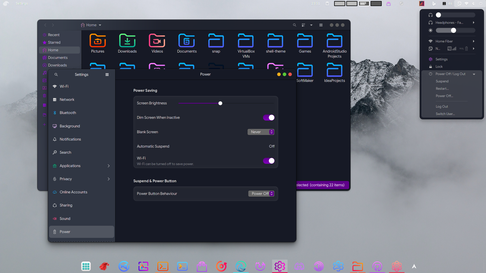

# NewSur theme for [GTK](https://www.gtk.org/)

> A dark theme for GNOME based on [WhiteSur](https://github.com/vinceliuice/WhiteSur-gtk-theme)

## Install

All instructions can be found at [INSTALL.md](./INSTALL.md)
## Team

This theme is maintained by the following person(s) and a bunch of [awesome contributors](https://github.com/Aryan20/NewSur-gtk-theme/graphs/contributors).

 |
--- |
[Aryan Kaushik](https://github.com/Aryan20) |

Note - Most of the code is contributed by different developers on the upstream original project, I commit those to keep mine updated but all the effort belongs to the original contributors.

## License

[MIT License](./LICENSE)
